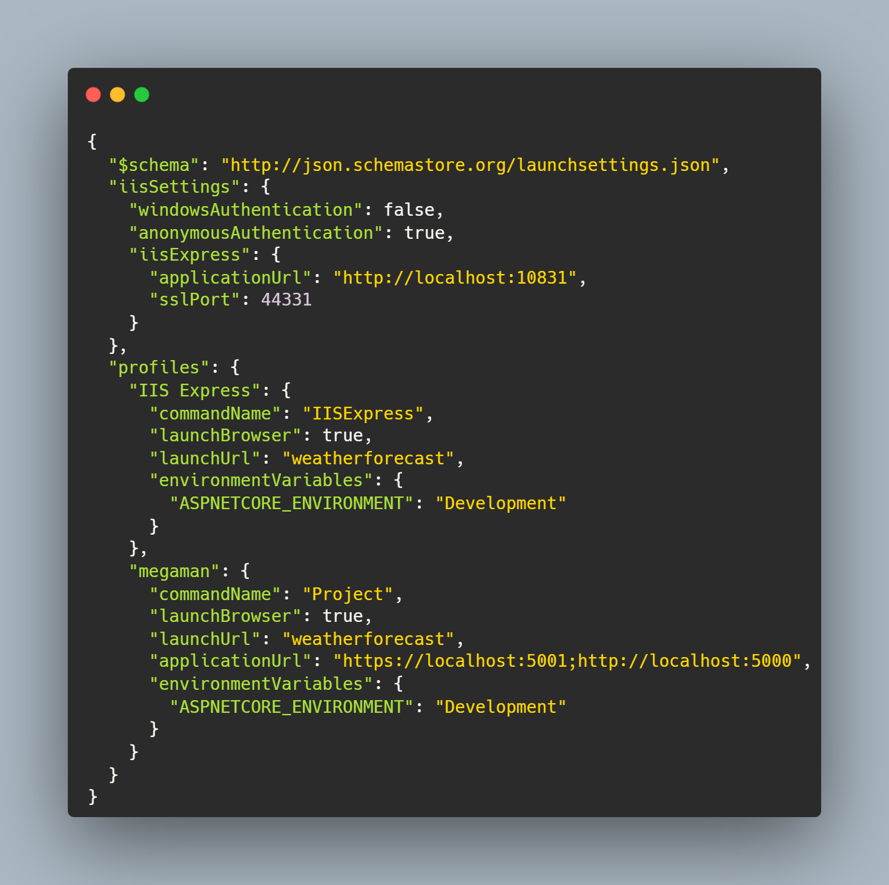

<table align="center">
    <tr>
        <td align="center" width="25%">
            
        </td>
        <td align="center" width="75%">
          
# MegaMan Bosses API
          
!Release workflow
!Latest release
  <br>
!Canary workflow
!Latest canary release
<p align="center">
    <a href="https://discord.gg/seuDiscord">
        
</p>
        </td>
    </tr>
</table>

<p align="center">
  MegaMan Bosses API é uma API desenvolvida em .NET Core 3.1 para listar os dados dos bosses de MegaMan.
  O objetivo principal é fornecer um backend que retorna JSONs no formato especificado.
  <br />
</p>
<p align="center">
  Guias e documentação podem ser encontrados na <a href="https://github.com/soaresaj/MegaApiDotnetCore/wiki">Wiki</a>.
</p>
<p align="center">
  Clique abaixo para entrar no Discord:
  <br>
  <a href="https://discord.gg/seuDiscord">
      
  </a>
  <br>
  <br>
  
</p>

## Exemplo de JSON retornado

 <p align="center">
    <br />
    
 </p>

## Especificações do Projeto

```xml
<Project Sdk="Microsoft.NET.Sdk.Web">

  <PropertyGroup>
    <TargetFramework>netcoreapp3.1</TargetFramework>
  </PropertyGroup>

  <ItemGroup>
    <PackageReference Include="Microsoft.EntityFrameworkCore" Version="3.1.8" />
   .8">
      <IncludeAssets>runtime; build; native; contentfiles; analyzers; buildtransitive</IncludeAssets>
      <PrivateAssets>all</PrivateAssets>
    </PackageReference>
    <PackageReference Include="Microsoft.EntityFrameworkCore.SqlServer" Version="3.1.8" />
    <PackageReference Include="Newtonsoft.Json" Version="12.0.2" />
  </ItemGroup>

</Project>
```

## Endpoints

```csharp
namespace Megaman.Controllers
{
    //api/v1/robots
    [ApiController]
    [Route("api/v1/robots")]
    public class RobotsController : ControllerBase
    {
        private readonly IRobotServices _services;
        public RobotsController(IRobotServices services)
        {
           _services = services;
        }

        //GET api/robots
        [HttpGet]
        public ActionResult<IEnumerable<RobotReadDTO>> GetAllRobots()
        {
            var robotItems = _services.SearchAll();
            return Ok(robotItems);
        }

        //GET api/v1/robots/{id}
        [HttpGet]
        [Route("{id:int}")]
        object GetCommandById([FromRoute]int id)
        {
            var robot = _services.SearchById(id);

            if(robot != null)
                return Ok(robot);

                return NotFound(
                        new { message = "Nenhum robo encontrado" }
                );
        }

        //POST api/v1/robots
        [HttpPost]
        public ActionResult RobotSend(){
            return Ok();
        }
    }
}
```

## Dependências

| Dependência | Versão | Link |
|-------------|--------|------|
| Microsoft.EntityFrameworkCore | 3.1.8 | Página Oficial |
| Microsoft.EntityFrameworkCore.Design | 3.1.8 | Página Oficial |
| Microsoft.EntityFrameworkCore.SqlServer | 3.1.8 | Página Oficial |
| Newtonsoft.Json | 12.0.2 | Página Oficial |

## Estrutura do Projeto

```plaintext
.vs
.vscode
bin
Controllers
Database
middlewares
Models
obj
Properties
Services
appsettings.Development.json
appsettings.json  
global.json
MegamanApi.csproj  
MegamanApi.sln
Program.cs
Startup.cs
```

## Técnicas Utilizadas

- **.NET Core 3.1**: Framework utilizado para desenvolver a API.
- **Entity Framework Core**: ORM utilizado para interagir com o banco de dados SQL Server.
- **Newtonsoft.Json**: Biblioteca utilizada para serialização e desserialização de JSON.
- **Arquitetura de Controllers**: Utilização de controllers para gerenciar as rotas e endpoints da API.
- **Injeção de Dependência**: Utilização de injeção de dependência para gerenciar os serviços da aplicação.

## Como Executar

Siga os passos abaixo para configurar e executar rapidamente a MegaMan Bosses API:

1. **Clone o repositório**:
   ```bash
   git clone <https://github.com/soaresaj/MegaApiDotnetCore.git>
   cd <MegaApiDotnetCore>
   ```

2. **Instale as dependências**:
   ```bash
   dotnet restore
   ```

3. **Configure o banco de dados**:
   - Certifique-se de ter um servidor SQL Server em execução.
   - Atualize a string de conexão no arquivo `appsettings.json` com as informações do seu banco de dados.

4. **Execute as migrações do Entity Framework**:
   ```bash
   dotnet ef database update
   ```

5. **Execute a aplicação**:
   ```bash
   dotnet run
   ```

6. **Acesse a API**:
   - A API estará disponível em `https://localhost:5001` ou `http://localhost:5000`.

### Exemplos de Uso

- **Obter todos os bosses**:
  ```bash
  curl -X GET "https://localhost:5001/api/v1/robots" -H "accept: application/json"
  ```

- **Obter detalhes de um boss específico**:
  ```bash
  curl -X GET "https://localhost:5001/api/v1/robots/1" -H "accept: application/json"
  ```

## Arquitetura do Projeto

```🌐
src
├── 📂 Controllers      [Routes for endpoints]
├── 📂 Models           [Database models]
├── 📂 Services         [Business rules]
├── 📂 Middlewares      [Intermediate functions between the HTTP request and the final server response]
├── 📂 Database         [Structures related to the database]
│   ├── 📂 DTOs             [Input Models and View Models (Data Transfer Objects)]
│   ├── 📂 EntityFramework  [Files related to the ORM Entity Framework]
│   │     ├── 📂 Context         [Entity context settings]
│   │     ├── 📂 Migrations      [Migrations for database updates]
│   ├── 📂 Repositories     [Repository pattern]
```

## Contribuições

Contribuições são bem-vindas! Sinta-se à vontade para abrir issues e pull requests.

## Licença

Este projeto está licenciado sob a Licença [MIT]. Veja o arquivo LICENSE para mais detalhes.
```
⌨️ Antonio José Soares -
[Github] (https://github.com/soaresaj)
